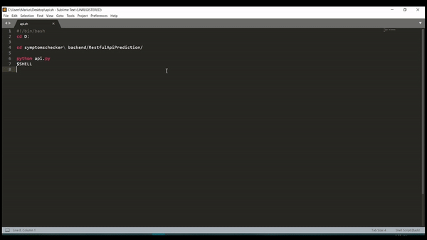
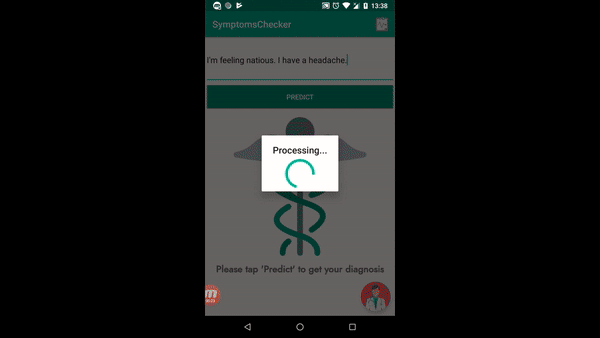

# SymptomsChecker

BSc Project, using Android SDK and Python.

## About
The purpose of this application is to predict a diagnosis based on the user's symptoms. The training data was provided by several DBs ([Wikidata](https://www.wikidata.org/wiki/Wikidata:Main_Page) / [DBpedia](https://wiki.dbpedia.org/) / [MayoClinic](https://www.mayoclinic.org/)) ~ 5000 diseases; each containing symptoms.

The prediction was made using 3 classifiers from [scikit-learn](https://scikit-learn.org/stable/) library (Naive Bayes/ Random Forests/ Logistic Regression). Each prediction contains a chance rate of occurence alongside useful suggestions, that would improve the accuracy of the prediction, if that symptom has evidence in that individual.

### Demo - Initializing remote local server

### Demo - App

## Credits

Images and icons provided by : 

* [SmashIcons](https://www.flaticon.com/packs/medical-asserts)
* [IconPond](https://www.flaticon.com/packs/medical-33)
